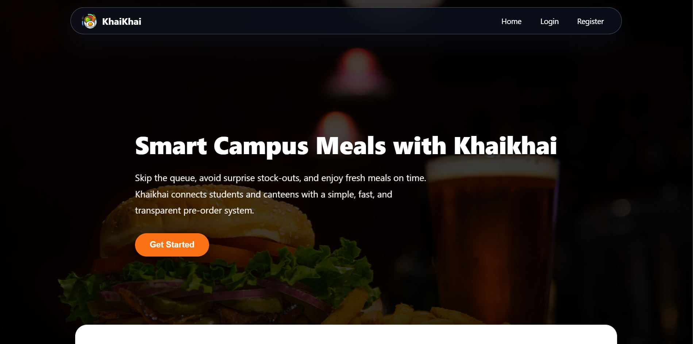
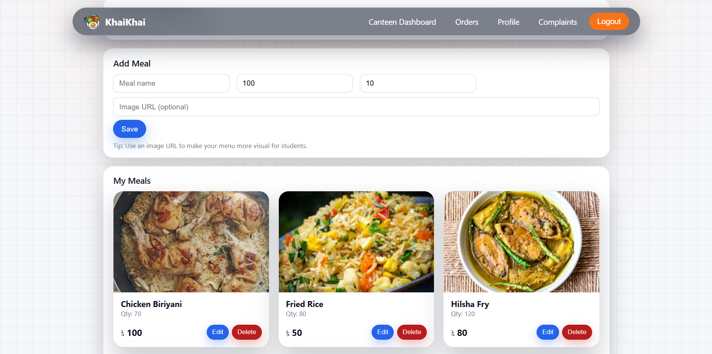
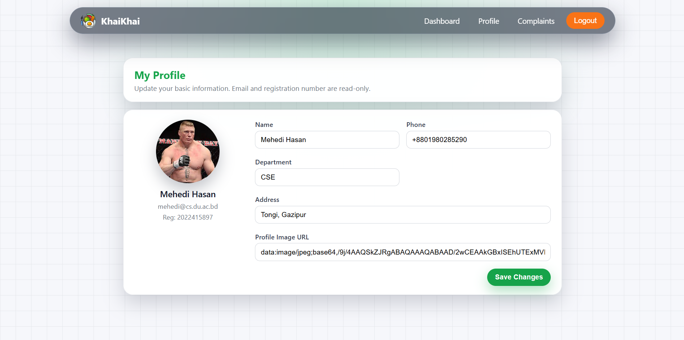
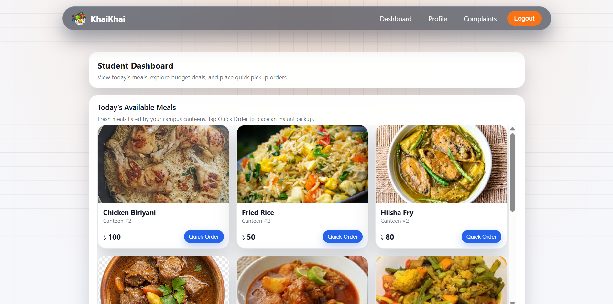
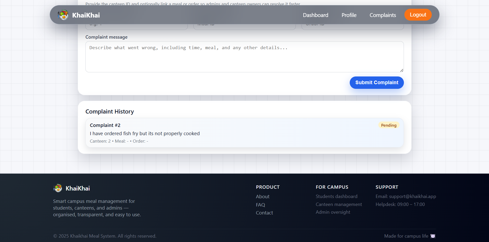
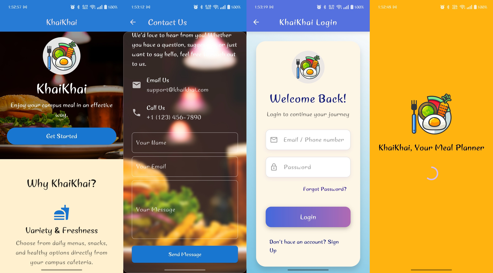

# KhaiKhai - Your Meal Planner

  
    
  <strong>A Hybrid Platform in mobile app and website to guide your food plan whole month :)</strong>

## 🥗 About The Project

**KhaiKhai** is a smart meal planning platform designed to help students and busy individuals manage their daily food choices effectively.
Our goal is to make eating both affordable and healthy, while also considering canteen availability, personal budget, and even weather conditions.
There will be mainly 2 types of people, students and canteen owners.
Students will use mobile app to upload their budget, see best deal for each day, food recommendation for him.
Canteen Owners will upload thir daily menus with budgets and take orders from students.
There will be an admin section for handle all types of problem in both side (we assumed it as University Authority).

## ✨ What We Do

**📅 Daily Meal Planning:** Get a personalized plan for breakfast, lunch, snacks, and dinner.

**💰 Budget-Friendly Choices:** Input your monthly pocket money, and KhaiKhai ensures you never overspend.

**🍴 Canteen Integration:** See real menus from nearby canteens and get suggestions on where to eat.

**🌦️ Weather-Aware Recommendations:** Whether it’s a sunny or rainy day, KhaiKhai suggests meals that fit the weather.

**🥦 Health Focused:** Balanced diet suggestions to keep you energized throughout the day.

## Website
| Page | Screenshot |
|---|---|
| Welcome Page |  |
| Menu Upload Page |  |
| Profile Page |  |
| Student Page |  |
| Complaint Page |  |
## Mobile App

## 🚀 Why KhaiKhai?

Managing food expenses and making healthy choices can be difficult for students and young professionals. KhaiKhai bridges the gap between budget constraints and nutritional needs, providing a hybrid solution accessible from both Flutter mobile apps and React web apps, powered by a robust FastAPI backend and MongoDB database.

## 🌟 Features

### 🍽️ Smart Meal Planning
- Generates a **30-day meal plan** including breakfast, lunch, snacks, and dinner.
- Balances **nutrition** and **budget** to ensure affordable, healthy meals tailored to students.

### 💰 Budget Management
- Input your monthly pocket money.
- Automatically suggests meals that fit within your budget.
- Tracks spending to prevent overshooting your balance.

### 🍴 Canteen Integration
- Connects with campus canteens to display **real-time menus**.
- Suggests meals from available items with detailed nutritional information.
- Tracks canteen orders and earnings for canteen owners.

### 🌦️ Weather-Aware Recommendations
- Adjusts meal suggestions based on daily weather (e.g., light meals on hot days, warm soups on rainy days).

### 👤 User & Student Profiles
- Role-based access for **students**, **admins**, and **canteen owners**.
- Students can view personalized meal plans and order history.
- Canteen owners can manage menus, update item availability, and track earnings.

### 📊 Orders & Complaints System
- Students can place orders directly through the app.
- Integrated **complaint box** for reporting issues and tracking resolutions.

### 🔒 Secure & Scalable
- **User authentication** with secure password storage.
- Built using a **FastAPI** backend, **MongoDB** database, **Flutter** mobile app, and **React** website.
- Designed for scalability and a modern, user-friendly interface.

## 🛠️ Tech Stack

| Layer               | Technology                          |
|--------------------|------------------------------------|
| Backend             | FastAPI                             |
| Frontend (Web)      | React.js                            |
| Frontend (Mobile)   | Flutter                             |
| Database            | MongoDB                             |
| Deployment          | Vercel (frontend), Render (backend)|

## 📡 API Endpoints

You can test these endpoints via Postman or a browser.

| Method | Endpoint           | Description                     |
|--------|------------------|---------------------------------|
| GET    | /users/           | Retrieve all users              |
| GET    | /students/        | Retrieve all students           |
| GET    | /canteens/        | Retrieve all canteens           |
| GET    | /mealplans/       | Retrieve a student's meal plan  |
| GET    | /weather/         | Get current weather info        |
| POST   | /orders/          | Place a new order               |
| POST   | /complaints/      | Submit a complaint              |

## 👨‍💻 Developers

| Name | Department | Email |
|------|-------------|--------|
| **Mehedi Hasan** | CSE, University of Dhaka | [mehedi200105075@gmail.com](mailto:mehedi200105075@gmail.com) |
| XX | CSE, University of Dhaka | [email@gmail.com](mailto:email@gmail.com) |
| XX | CSE, University of Dhaka | [email@gmail.com](mailto:email@gmail.com) |
| XX | CSE, University of Dhaka | [email@gmail.com](mailto:email@gmail.com) |
| XX | CSE, University of Dhaka | [email@gmail.com](mailto:email@gmail.com) |
